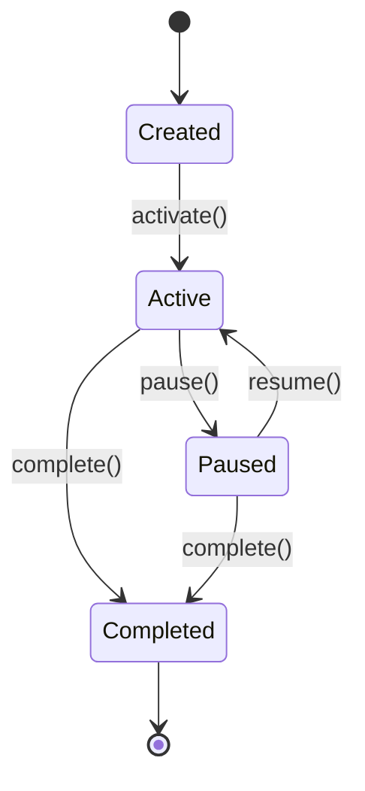
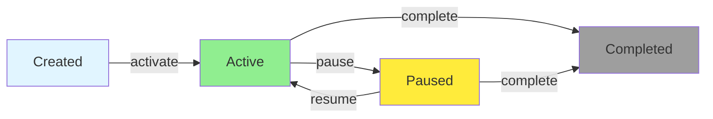

状态机（State Machine）是一种常见的设计模式，特别适合用于管理智能合约中的复杂状态转换。使用枚举（Enum）配合状态机模式，可以让合约的状态管理更加清晰、安全和可维护。

## 什么是状态机

状态机是一个由**状态**和**转换**组成的系统：

- **状态（State）**：系统在某一时刻所处的情况
- **转换（Transition）**：从一个状态到另一个状态的规则
- **事件（Event）**：触发状态转换的操作

在[智能合约](https://learnblockchain.cn/tags/%E6%99%BA%E8%83%BD%E5%90%88%E7%BA%A6)中，状态机可以确保：
1. 状态转换的合法性
2. 操作的顺序性
3. 业务逻辑的清晰性

## 基本状态机实现

### 简单的状态转换

```solidity
pragma solidity ^0.8.0;

contract SimpleStateMachine {
    enum State { Created, Started, Paused, Completed }
    State public currentState;

    event StateChanged(State indexed oldState, State indexed newState);

    constructor() {
        currentState = State.Created;
    }

    // 状态转换：Created -> Started
    function start() public {
        require(currentState == State.Created, "Can only start from Created");
        State oldState = currentState;
        currentState = State.Started;
        emit StateChanged(oldState, currentState);
    }

    // 状态转换：Started -> Paused
    function pause() public {
        require(currentState == State.Started, "Can only pause when Started");
        State oldState = currentState;
        currentState = State.Paused;
        emit StateChanged(oldState, currentState);
    }

    // 状态转换：Paused -> Started
    function resume() public {
        require(currentState == State.Paused, "Can only resume when Paused");
        State oldState = currentState;
        currentState = State.Started;
        emit StateChanged(oldState, currentState);
    }

    // 状态转换：Started/Paused -> Completed
    function complete() public {
        require(
            currentState == State.Started || currentState == State.Paused,
            "Invalid state to complete"
        );
        State oldState = currentState;
        currentState = State.Completed;
        emit StateChanged(oldState, currentState);
    }
}
```

## 复杂应用场景

### 1. 投票系统

投票系统需要管理提案的多个状态，确保投票流程的严格执行：

```solidity
pragma solidity ^0.8.0;

contract VotingSystem {
    enum VoteOption { Abstain, Yes, No }
    enum ProposalState { Pending, Active, Passed, Rejected, Executed }

    struct Proposal {
        string description;
        ProposalState state;
        uint yesVotes;
        uint noVotes;
        uint startTime;
        uint endTime;
    }

    mapping(uint => Proposal) public proposals;
    mapping(uint => mapping(address => VoteOption)) public votes;
    uint public proposalCount;

    event ProposalCreated(uint indexed proposalId, string description);
    event ProposalStateChanged(uint indexed proposalId, ProposalState newState);
    event Voted(uint indexed proposalId, address indexed voter, VoteOption option);

    // 创建提案
    function createProposal(string memory description, uint duration) public {
        uint proposalId = proposalCount++;
        proposals[proposalId] = Proposal({
            description: description,
            state: ProposalState.Pending,
            yesVotes: 0,
            noVotes: 0,
            startTime: block.timestamp,
            endTime: block.timestamp + duration
        });
        emit ProposalCreated(proposalId, description);
    }

    // 激活提案（状态转换：Pending -> Active）
    function activateProposal(uint proposalId) public {
        Proposal storage proposal = proposals[proposalId];
        require(proposal.state == ProposalState.Pending, "Proposal must be pending");

        proposal.state = ProposalState.Active;
        emit ProposalStateChanged(proposalId, ProposalState.Active);
    }

    // 投票（仅在 Active 状态）
    function vote(uint proposalId, VoteOption option) public {
        Proposal storage proposal = proposals[proposalId];
        require(proposal.state == ProposalState.Active, "Proposal not active");
        require(block.timestamp < proposal.endTime, "Voting period ended");
        require(votes[proposalId][msg.sender] == VoteOption.Abstain, "Already voted");

        votes[proposalId][msg.sender] = option;

        if (option == VoteOption.Yes) {
            proposal.yesVotes++;
        } else if (option == VoteOption.No) {
            proposal.noVotes++;
        }

        emit Voted(proposalId, msg.sender, option);
    }

    // 结束投票（状态转换：Active -> Passed/Rejected）
    function finalizeProposal(uint proposalId) public {
        Proposal storage proposal = proposals[proposalId];
        require(proposal.state == ProposalState.Active, "Proposal not active");
        require(block.timestamp >= proposal.endTime, "Voting period not ended");

        if (proposal.yesVotes > proposal.noVotes) {
            proposal.state = ProposalState.Passed;
        } else {
            proposal.state = ProposalState.Rejected;
        }

        emit ProposalStateChanged(proposalId, proposal.state);
    }

    // 执行提案（状态转换：Passed -> Executed）
    function executeProposal(uint proposalId) public {
        Proposal storage proposal = proposals[proposalId];
        require(proposal.state == ProposalState.Passed, "Proposal must be passed");

        // 执行提案逻辑...
        proposal.state = ProposalState.Executed;
        emit ProposalStateChanged(proposalId, ProposalState.Executed);
    }
}
```

### 2. 游戏角色状态

游戏中的角色需要管理多种状态，确保游戏规则的正确执行：

```solidity
pragma solidity ^0.8.0;

contract GameCharacter {
    enum CharacterClass { Warrior, Mage, Archer, Rogue }
    enum CharacterState { Idle, Fighting, Resting, Dead }

    struct Character {
        string name;
        CharacterClass class;
        CharacterState state;
        uint health;
        uint level;
    }

    mapping(address => Character) public characters;

    event CharacterCreated(address indexed player, string name, CharacterClass class);
    event StateChanged(address indexed player, CharacterState oldState, CharacterState newState);
    event HealthChanged(address indexed player, uint newHealth);

    // 创建角色
    function createCharacter(string memory name, CharacterClass class) public {
        require(bytes(characters[msg.sender].name).length == 0, "Character already exists");

        characters[msg.sender] = Character({
            name: name,
            class: class,
            state: CharacterState.Idle,
            health: 100,
            level: 1
        });

        emit CharacterCreated(msg.sender, name, class);
    }

    // 开始战斗（状态转换：Idle -> Fighting）
    function startBattle() public {
        Character storage char = characters[msg.sender];
        require(bytes(char.name).length > 0, "Character does not exist");
        require(char.state == CharacterState.Idle, "Must be idle to start battle");
        require(char.health > 0, "Character is dead");

        CharacterState oldState = char.state;
        char.state = CharacterState.Fighting;
        emit StateChanged(msg.sender, oldState, CharacterState.Fighting);
    }

    // 结束战斗（状态转换：Fighting -> Idle/Dead）
    function endBattle(uint damage) public {
        Character storage char = characters[msg.sender];
        require(char.state == CharacterState.Fighting, "Not in battle");

        CharacterState oldState = char.state;

        if (damage >= char.health) {
            char.health = 0;
            char.state = CharacterState.Dead;
        } else {
            char.health -= damage;
            char.state = CharacterState.Idle;
        }

        emit HealthChanged(msg.sender, char.health);
        emit StateChanged(msg.sender, oldState, char.state);
    }

    // 休息恢复（状态转换：Idle -> Resting -> Idle）
    function rest() public {
        Character storage char = characters[msg.sender];
        require(char.state == CharacterState.Idle, "Must be idle to rest");

        CharacterState oldState = char.state;
        char.state = CharacterState.Resting;
        emit StateChanged(msg.sender, oldState, CharacterState.Resting);

        // 恢复生命值
        if (char.health < 100) {
            char.health = 100;
            emit HealthChanged(msg.sender, char.health);
        }

        // 休息完成，回到 Idle
        char.state = CharacterState.Idle;
        emit StateChanged(msg.sender, CharacterState.Resting, CharacterState.Idle);
    }

    // 获取角色类型说明
    function getClassDescription(CharacterClass class) public pure returns (string memory) {
        if (class == CharacterClass.Warrior) {
            return "Strong melee fighter";
        } else if (class == CharacterClass.Mage) {
            return "Powerful magic user";
        } else if (class == CharacterClass.Archer) {
            return "Skilled ranged attacker";
        } else {
            return "Stealthy assassin";
        }
    }
}
```

### 3. 托管交易状态机

托管合约需要严格管理交易状态，确保资金安全：

```solidity
pragma solidity ^0.8.0;

contract Escrow {
    enum EscrowState {
        Created,          // 创建
        FundsDeposited,   // 资金已存入
        InDispute,        // 争议中
        Completed,        // 完成
        Refunded,         // 已退款
        Cancelled         // 已取消
    }

    struct EscrowTransaction {
        address buyer;
        address seller;
        uint amount;
        EscrowState state;
    }

    mapping(uint => EscrowTransaction) public transactions;
    uint public transactionCount;

    event EscrowCreated(uint indexed txId, address indexed buyer, address indexed seller, uint amount);
    event StateChanged(uint indexed txId, EscrowState oldState, EscrowState newState);

    // 创建托管交易（状态：Created -> FundsDeposited）
    function createEscrow(address seller) public payable returns (uint) {
        require(msg.value > 0, "Must send funds");

        uint txId = transactionCount++;
        transactions[txId] = EscrowTransaction({
            buyer: msg.sender,
            seller: seller,
            amount: msg.value,
            state: EscrowState.FundsDeposited
        });

        emit EscrowCreated(txId, msg.sender, seller, msg.value);
        emit StateChanged(txId, EscrowState.Created, EscrowState.FundsDeposited);
        return txId;
    }

    // 完成交易（状态转换：FundsDeposited -> Completed）
    function completeEscrow(uint txId) public {
        EscrowTransaction storage txn = transactions[txId];
        require(msg.sender == txn.buyer, "Only buyer can complete");
        require(txn.state == EscrowState.FundsDeposited, "Invalid state");

        EscrowState oldState = txn.state;
        txn.state = EscrowState.Completed;
        payable(txn.seller).transfer(txn.amount);

        emit StateChanged(txId, oldState, EscrowState.Completed);
    }

    // 发起争议（状态转换：FundsDeposited -> InDispute）
    function raiseDispute(uint txId) public {
        EscrowTransaction storage txn = transactions[txId];
        require(
            msg.sender == txn.buyer || msg.sender == txn.seller,
            "Not authorized"
        );
        require(txn.state == EscrowState.FundsDeposited, "Invalid state");

        EscrowState oldState = txn.state;
        txn.state = EscrowState.InDispute;
        emit StateChanged(txId, oldState, EscrowState.InDispute);
    }

    // 退款给买家（状态转换：FundsDeposited/InDispute -> Refunded）
    function refund(uint txId) public {
        EscrowTransaction storage txn = transactions[txId];
        require(msg.sender == txn.seller, "Only seller can refund");
        require(
            txn.state == EscrowState.FundsDeposited ||
            txn.state == EscrowState.InDispute,
            "Invalid state"
        );

        EscrowState oldState = txn.state;
        txn.state = EscrowState.Refunded;
        payable(txn.buyer).transfer(txn.amount);

        emit StateChanged(txId, oldState, EscrowState.Refunded);
    }
}
```

## 状态机设计最佳实践

### 1. 使用 Modifier 简化状态检查

```solidity
contract StateMachineWithModifiers {
    enum State { Created, Active, Paused, Completed }
    State public state;

    modifier inState(State _state) {
        require(state == _state, "Invalid state");
        _;
    }

    modifier transitionTo(State _newState) {
        _;
        state = _newState;
    }

    function activate() public inState(State.Created) transitionTo(State.Active) {
        // 激活逻辑
    }

    function pause() public inState(State.Active) transitionTo(State.Paused) {
        // 暂停逻辑
    }
}
```

### 2. 绘制状态转换图

在设计复杂状态机时，建议先绘制状态转换图：



或者使用流程图形式：



### 3. 记录所有状态变化

```solidity
event StateChanged(
    uint indexed entityId,
    State indexed oldState,
    State indexed newState,
    uint timestamp,
    address actor
);

function changeState(uint entityId, State newState) internal {
    State oldState = entities[entityId].state;
    entities[entityId].state = newState;

    emit StateChanged(
        entityId,
        oldState,
        newState,
        block.timestamp,
        msg.sender
    );
}
```

### 4. 实现状态转换验证函数

```solidity
function canTransition(State from, State to) internal pure returns (bool) {
    // 定义允许的状态转换
    if (from == State.Created && to == State.Active) return true;
    if (from == State.Active && to == State.Paused) return true;
    if (from == State.Paused && to == State.Active) return true;
    if ((from == State.Active || from == State.Paused) && to == State.Completed) return true;

    return false;
}

function setState(State newState) internal {
    require(canTransition(state, newState), "Invalid state transition");
    state = newState;
}
```

## 小结

状态机模式是[智能合约](https://learnblockchain.cn/tags/%E6%99%BA%E8%83%BD%E5%90%88%E7%BA%A6)开发中的重要设计模式：

- **清晰性**：枚举让状态定义清晰明确
- **安全性**：严格的状态转换检查防止非法操作
- **可维护性**：状态转换逻辑集中管理
- **可追溯性**：事件记录完整的状态变化历史

在设计复杂业务逻辑时，优先考虑使用状态机模式，它能让合约更加健壮和易于理解。

## 相关资源

- [枚举类型](https://learnblockchain.cn/article/22564) - 学习枚举的基础知识
- [函数修改器](https://learnblockchain.cn/article/22555) - 使用 modifier 简化状态检查
- [事件](https://learnblockchain.cn/article/22556) - 记录状态变化
